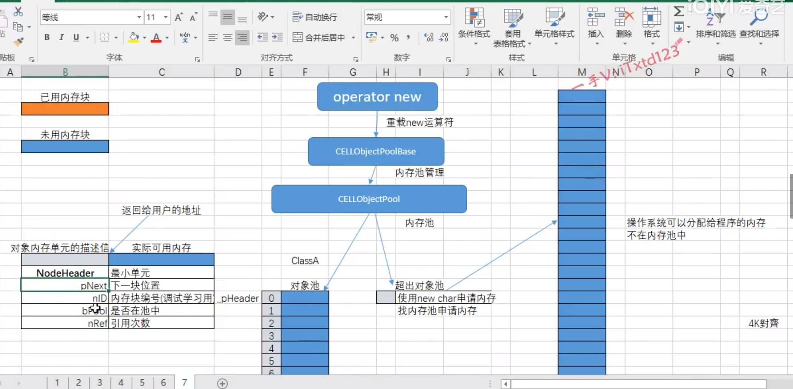

# c++高并发通信引擎实现 

## 阶段更新记录

### 服务端和客户端采用select模型
select函数原型（linux平台下）
~~~ 
int select(int nfds, fd_set *readfds, fd_set *writefds,
                  fd_set *exceptfds, struct timeval *timeout); 
~~~
参数解析：
* nfds 在windows下该参数没有意义，而在类unix平台下该参数表示要监听的文件描述符中最大的那个加1
* readfds 要监听的读文件描述符，也就是可读
* writefds 要监听的写文件描述符，也就是可写
* exceptfds 要监听的异常描述符
* timeout 超时时间，传NULL为阻塞模式，也就是io就绪时，才会返回继续执行；

服务端升级select模型：服务端升级select模型较为麻烦，因为服务端与客户端通讯时，服务端是两个文件描述符，也就是两个socket，
因此需要将两个文件描述符都加入到readfds。大致流程为：调用select启动监听，当用于监听的文件描述符可读就绪时，说明有新的客户端连接，
这时进入accept逻辑，将accept返回的用于与客户端通讯的文件描述符加入监听中。当用于通讯的文件描述符可读就绪时，说明客户端发送内容到服务器了，
这时调用服务器的处理逻辑，进行接收即可。

客户端升级select模型与服务端类似，较为简单。

### 服务端和客户端完成跨平台移植（windows，linux，MacOS）
各个平台下，不同的地方有几个点：
* 首先是头文件的不同,在不同的平台下通过预处理器处理来完成跨平台
~~~
#ifdef _WIN32
	#define WIN32_LEAN_AND_MEAN
	#define _WINSOCK_DEPRECATED_NO_WARNINGS
	#include <windows.h>
	#include <WinSock2.h>
#else
	#include <unistd.h>
	#include <arpa/inet.h>
	#include <string.h>

	#define SOCKET int
	#define INVALID_SOCKET  (SOCKET)(~0)
	#define SOCKET_ERROR            (-1)
#endif
~~~
* 一些函数的不同，例如函数参数等

windows平台特有的
~~~
#ifdef _WIN32
		WORD ver = MAKEWORD(2, 2);
		WSADATA data;
		WSAStartup(ver, &data);
#endif
~~~
不同平台下函数的不同
~~~
#ifdef _WIN32
		if (ip) {
			serv_addr.sin_addr.S_un.S_addr = inet_addr(ip);
		}
		else {
			serv_addr.sin_addr.S_un.S_addr = INADDR_ANY;
		}	
#else
		if (ip) {
			serv_addr.sin_addr.s_addr = inet_addr(ip);
		}
		else {
			serv_addr.sin_addr.s_addr = INADDR_ANY;
		}
#endif
~~~

### 服务端和客户端完成封装，开始面向对象

从c到cpp，进入面向对象的阶段，这一阶段主要是将服务端和客户端的功能进行封装，以便于更好的使用。同时，
也为后续开发打好基础，在此基础上，可以为后续更好的扩展功能。

### 解决tcp的“黏包，少包”问题，以及特殊场景下socket缓冲区溢出，网络阻塞等问题

#### 黏包，少包

首先，上述黏包和少包都不是tcp本身的问题，而是由于使用者对tcp的理解不够引起的问题，
tcp网络传输中传输的是无边无际的字节流，无法将上层应用层协议的数据包分开，需要我们手动设置好数据包的边界，提取数据包。
解决办法也很简单，对于变长的数据包，设置包头，包头内指明数据包的长度，这样就可以解决上述问题了。

#### 缓冲区溢出，网络阻塞等问题

造成上述问题的原因有很多，其中一个场景是当发送端高频快速的发送数据，而接收端处理速度不够时，
这时tcp会采取流量控制机制，也就是接收端会告诉发送端接收窗口的大小，也就是0，这时发送端不可以在发送数据，但是发送端代码有问题，
就是一个while循环，一直发，造成缓冲区溢出，数据丢失。

解决办法：
解决办法也很简单，即提升接收端处理数据的效率。具体做法是在接收端每次调用recv时，要尽可能的将socket缓冲区中的数据取走，可以设置一个消息缓冲区，
将数据放到消息缓冲区中，然后再从消息缓冲区中取数据。这样就可以尽可能的增大接收端的处理能力。
具体代码如下：
~~~
//接收消息
	int RecvData(ClientSocketRef client_socket) {
		int recv_len = recv(client_socket->GetSocketFd(), _server_recv_buf, RECV_BUF_SIZE, 0);
		if (recv_len <= 0) {
			printf("the client terminated the connection...\n");
			return -1;
		}

		char* client_recv_buf = client_socket->GetRecvBuf();
		int lastpos = client_socket->GetLastPos();
		std::memcpy(client_recv_buf + lastpos, _server_recv_buf, recv_len);
		client_socket->SetLastPos(lastpos + recv_len);

		while (client_socket->GetLastPos() >= sizeof(MessageHeader)) {
			MessageHeader* header = (MessageHeader*)client_recv_buf;
			if (client_socket->GetLastPos() >= header->_data_length) {
				//取出一个数据包后，缓冲区中剩余数据的长度
				auto n_size = client_socket->GetLastPos() - header->_data_length;
				OnNetMessage(client_socket, header);
				std::memcpy(client_socket->GetRecvBuf(), client_socket->GetRecvBuf() + (header->_data_length), n_size);
				client_socket->SetLastPos(n_size);
			}
			else {
				break;
			}
		}
		return 0;
	}
~~~

### 阶段性小目标 10000连接每秒处理300000个数据包

将server的监听连接和维持连接分开，在EasyTcpServer中维持一个CellServer集合，
将具体的收发消息交给CellServer。EasyTcpServer监听连接，连接建立成功后，将CellClient交给具体的CellServer
，这里会挑选一个维持客户端数量少的CellServer。

#### 如何将CellClient交给CellServer？

这就是经典的生产者消费者模式，EasyTcpServer是生产者，CellServer是消费者，
CellServer中的
~~~
	//待监听的客户端队列
	std::vector<ClientSocketRef> _client_socket_buf;
~~~
是消息连接的桥梁，EasyTcpServer往里面放，CellServer从里面取，中间需要加锁保持同步。

### 引入内存管理，内存池的设计与实现

#### 1. 什么是内存池
1.1 池化技术

池是在计算技术中经常使用的一种设计模式，其内涵在于：将程序中需要经常使用的核心资源先申请出来，放到一个池内，有程序自管理，这样可以提高资源的利用率，也可以保证本程序占有的资源数量，经常使用的池化技术包括内存池，线程池，和连接池等，其中尤以内存池和线程池使用最多。

1.2 内存池

* 内存池（Memory Pool）是一种动态内存分配与管理技术，通常情况下，程序员习惯直接使用new，delete，malloc,free等API申请和释放内存，这样导致的后果就是：当程序运行的时间很长的时候，由于所申请的内存块的大小不定，频繁使用时会造成大量的内存碎片从而降低程序和操作系统的性能。
* 内存池则是在真正使用内存之前，先申请分配一大块内存（内存池）留作备用。当程序员申请内存时，从池中取出一块动态分配，当程序员释放时，将释放的内存放回到池内，再次申请，就可以从池里取出来使用，并尽量与周边的空闲内存块合并。若内存池不够时，则自动扩大内存池，从操作系统中申请更大的内存池。

#### 2. 为什么需要内存池

内存碎片问题

造成堆利用率很低的一个主要原因就是内存碎片化。如果有未使用的存储器，但是这块存储器不能用来满足分配的请求，这时候就会产生内存碎片化问题。
* 内部碎片是指一个已分配的块比有效载荷大时发生的。(假设以前分配了10个大小的字节，现在只用了5个字节，则剩下的5个字节就会内碎片)。内部碎片的大小就是已经分配的块的大小和他们的有效载荷之差的和。因此内部碎片取决于以前请求内存的模式和分配器实现(对齐的规则)的模式。
* 假设系统依次分配了16byte、8byte、16byte、4byte，还剩余8byte未分配。这时要分配一个24byte的空间，操作系统回收了一个上面的两个16byte，总的剩余空间有40byte，但是却不能分配出一个连续24byte的空间，这就是外碎片问题。

申请效率问题

为什么频繁的申请和释放内存会造成系统性能的下降？

* 频繁的申请和释放内存会导致大量的内存碎片，使得内存分配效率降低
* 频繁的申请和释放内存会导致大量的缺页中断，使得进程陷入内核态，消耗系统资源
* 频繁的申请和释放内存会导致内存紧缩操作，使得进程需要调用brk或mmap等系统调用，增加系统开销

具体来说，当我们使用malloc或new等API申请分配内存时，实际上是分配了一块虚拟内存，没有分配物理内存。当我们第一次访问这块虚拟内存时，会发生缺页中断，操作系统负责分配物理内存，并建立虚拟内存和物理内存之间的映射关系。这个过程需要切换到内核态，并执行一系列操作，比如检查地址合法性，查找或分配物理页，填充物理页内容，建立映射关系等。这些操作都会消耗时间和资源。如果我们频繁地申请和释放不同大小的内存块，就会造成大量的缺页中断，从而降低系统性能。

例如，在一个请求来时，我们用malloc分配了2M的内存，请求结束后用free释放了这块内存。如果每个请求需要6个物理页，那么每个请求就会产生6个缺页中断，在2000的压力下，每秒就产生了10000多次缺页中断。这些缺页中断不需要读取磁盘解决，所以叫做minflt（minor fault）。缺页中断在内核态执行，因此进程的内核态cpu消耗很大。

另外，当我们用free或delete等API释放内存时，并不一定会真正地释放掉虚拟内存和物理内存。这取决于我们使用的是brk还是mmap来分配虚拟内存。brk是将数据段(.data)的最高地址指针_edata往高地址推，mmap是在进程的虚拟地址空间中（一般是堆和栈中间）找一块空闲的。如果我们使用brk分配虚拟内存，那么只有当高地址空间的空闲内存超过一定阈值时（默认是128K），才会执行内存紧缩操作（trim），将_edata指针往回推，并释放掉对应的物理页。如果我们使用mmap分配虚拟内存，那么释放时会调用munmap来解除映射关系，并释放掉对应的物理页。如果我们频繁地申请和释放大于128K的内存块（默认情况下malloc会调用mmap来分配大于128K的内存），就会造成频繁地调用mmap和munmap系统调用，增加系统开销。

综上所述，频繁地申请和释放内存会造成系统性能的下降，因为它涉及到虚拟地址空间的管理、物理内存的分配和释放、内核态和用户态的切换、内存碎片的产生等问题。为了提高性能，我们可以采用一些策略，比如使用内存池来预分配和重用固定大小的内存块，或者调整malloc参数来禁止调用mmap和内存紧缩等。
#### 3.内存池设计

内存池的设计原则：高效 简单 针对性强 使用简单

该项目中内存池的具体实现：

首先重载new运算符，通过重新定义new和delete来替换掉系统原本的new和delete。

另外针对内存池高效的特点，在内存申请时需要简单高效的映射，这里的映射方式很简单，就是通过定义一个
MemoryAlloc类型的指针数组，长度为该内存池最大的内存块的长度加一，这样在申请内存时，根据申请size的大小直接找到数组对应的元素的内存块申请即可。

内存池分为不同字节的池，根据系统需要来定义不同的字节池，例如64字节池，128字节池等等。
每种字节池的结构大致相同，都是由相同的头部加上指定的字节长度组成，将其成为内存块，头部称为块头。
块头是描述该内存块的信息结构体，内存块的申请和释放都是由修改块头的信息来完成的。块与块之间通过块头来构成链表。
MemoryAlloc内部维护一个可用的块头部head，申请和释放都需要修改head，以此来维护内存池的状态。

如果申请的内存size超过了内存池支持的最大内存块，则仍需要调用malloc和free来完成对应的内存的申请和释放。

#### 4.对象池的设计

该项目中对象池的设计：

核心思想与内存池类似，但是有几处不同：
* 首先需要定义一个ObjectPoolBase类，这个类重载了new和delete方法，这里的new和delete都是使用ObjectPool对象池来完成的
程序中有哪个需要使用对象池的类只需要继承该类即可，继承该类之后，对象创建就会从对象池中取，但是注意智能指针shared_ptr会有点不同，
在使用智能指针时不能使用make_shared等标准库函数，使用上述函数重载的new会失效。
* 这里的ObjectPool是泛型类，需要指定两个参数，具体的对象类型以及对象池的大小。通过指明这两个参数，ObjectPool通过单例模式构建唯一的对象池实例，
这里对象的构造器的参数涉及多参时，处理方式：
~~~
template<typename ...Args>
	static Type* createObject(Args ... args)
	{	//不定参数  可变参数
		Type* obj = new Type(args...);
		//可以做点想做的事情
		return obj;
	}
~~~
* 对象池和内存池是可以同时使用的，对象池中的new也是使用重载的new，这样进一步提升效率。

### 引入心跳检测，及时处理死连接，释放服务器资源

#### 为什么需要心跳检测，心跳检测的原理，心跳检测的实现方式？

在服务器开发中，服务端需要心跳检测的原因是为了监视客户端是否在线运行，并及时清理死连接和释放资源。

心跳检测的原理是客户端和服务端之间定时发送一些简单的信息，比如一个空字符串或者一个特定的数据包，来告诉对方自己还在。如果在一定时间内没有收到对方的心跳信息，就认为对方已经掉线或者异常，从而关闭连接并触发onClose回调。

心跳检测的方式有多种，比如：

* 客户端定时发送心跳，服务端设定多少秒内没收到心跳关闭连接。
* 服务端定时发送心跳，客户端设定多少秒内没收到心跳关闭连接。
* 客户端和服务端互相发送心跳，双方都设定多少秒内没收到心跳关闭连接。

#### 死连接出现的原因，死连接的危害，死连接的解决方式？

死连接现象的原因可能有以下几种：
* 客户端或服务端异常退出或崩溃，没有正常地关闭连接。
* 网络故障或中断，导致连接断开或丢失。
* 路由器或防火墙拦截或关闭了空闲的连接。
* 服务端资源不足，无法处理过多的连接请求。

死连接现象的危害可能有以下几种：
* 占用服务端的内存和端口资源，影响性能和安全性。
* 造成客户端的数据丢失或延迟，影响用户体验和业务逻辑。
* 导致服务端无法及时感知客户端的状态，影响监控和管理。

死连接现象的解决方法可能有以下几种：

* 使用心跳检测机制，定时发送和接收简单的信息，判断连接是否存活。
* 使用超时机制，设定连接的最大空闲时间，超过则关闭连接。
* 使用异常处理机制，捕获和处理连接异常或错误，及时释放资源。
* 使用负载均衡机制，分配和控制服务端的连接数，避免过载。

#### 心跳检测和tcp的keepalive有什么区别？使用哪个更好？

心跳检测和TCP的keepalive有以下几点区别：
* 心跳检测是应用层的概念，是指客户端和服务端之间定时发送一些简单的信息，比如一个空字符串或者一个特定的数据包，来告诉对方自己还在。心跳检测的方式和频率可以由应用层自己定义和控制。
* TCP的keepalive是传输层的概念，是指TCP协议提供的一种保活功能，用来探测连接对端是否存在，属于TCP协议栈的一部分。TCP的keepalive的参数和机制由操作系统决定，不同的操作系统可能有不同的默认值和设置方式

使用哪个更好，取决于具体的场景和需求。一般来说，心跳检测比TCP的keepalive更灵活和可控，可以根据应用层的逻辑来设计和调整。但是心跳检测也会增加应用层的开发和维护成本，以及网络流量。TCP的keepalive则比较简单和方便，只需要在套接字上设置SO_KEEPALIVE选项即可开启或关闭 。但是TCP的keepalive也有一些局限性，比如可能会被路由器或防火墙拦截，或者无法适应应用层的变化。

#### 如何在Linux系统中设置TCP keepalive的参数？

首先，你需要在你的应用程序中设置SO_KEEPALIVE选项，来开启或关闭TCP keepalive功能。这可以通过setsockopt函数来实现，例如：

~~~
int optval = 1; // 1表示开启，0表示关闭
setsockopt(socket_fd, SOL_SOCKET, SO_KEEPALIVE, &optval, sizeof(optval));
~~~

其次，你需要配置TCP keepalive的三个参数，分别是：

* tcp_keepalive_time: KeepAlive的空闲时长，或者说每次正常发送心跳的周期，默认值为7200s（2小时）。
* tcp_keepalive_intvl: KeepAlive探测包的发送间隔，默认值为75s
* tcp_keepalive_probes: 在tcp_keepalive_time之后，没有接收到对方确认，继续发送保活探测包次数，默认值为9（次）

这些参数可以通过修改 /etc/sysctl.conf 文件来设置，例如：

~~~
net.ipv4.tcp_keepalive_time=600
net.ipv4.tcp_keepalive_intvl=30
net.ipv4.tcp_keepalive_probes=5
~~~

然后，你需要执行 sysctl -p 命令来使配置生效，或者重启系统。你可以使用 sysctl -a | grep keepalive 命令来查看当前的配置。

#### 本项目中心跳检测的具体实现

服务端为每个建立连接的客户端维护一个CellClient，并且设置一个心跳死亡计时，当客户端发送心跳包到服务端时，重置
计时，这里不仅仅是心跳包，任意数据包都会重置计时。

主要逻辑代码：

~~~
void CheckTime()
	{
		//当前时间戳
		auto nowTime = CELLTime::getNowInMilliSec();
		auto dt = nowTime - _oldTime;
		_oldTime = nowTime;

		for (auto iter = _clients.begin(); iter != _clients.end(); )
		{
			//心跳检测
			if (iter->second->checkHeart(dt))
			{
				if (_pNetEvent)
					_pNetEvent->OnNetLeave(iter->second);
				_clients_change = true;
				delete iter->second;
				auto iterOld = iter;
				iter++;
				_clients.erase(iterOld);
				continue;
			}

			////定时发送检测
			//iter->second->checkSend(dt);

			iter++;
		}
	}
~~~

### 解决多线程并发server异常退出问题

问题的产生：

该通讯引擎将任务的处理分别交给不同类型的server来处理，EasyTcpServer负责监听连接，CellServer负责收发数据，其中发数据是交给内部CellTaskServer
来完成，这里面有一个问题，就是在CellServer和CellTaskServer里都有启动线程的操作，当这些对象在析构时，没有等到其启动的线程退出，便完成了析构，从而引起了错误。

解决方式：

该问题的本质即线程与对象绑定，在对象析构时，线程也应该退出，并且是立即退出，然后继续执行析构的过程，直到结束。

问题的本质其实就是解决办法，在启动线程的对象中执行析构时，应该阻塞，等到线程退出发出信号唤醒，从而继续执行析构的过程。

具体的代码，以CellServer为例：

CellServer的Close
~~~
//CellServer::Close()
//关闭Socket
	void Close()
	{
		CELLLog::Info("CELLServer%d.Close begin\n", _id);
		_taskServer.Close();
		_thread.Close();
		CELLLog::Info("CELLServer%d.Close end\n", _id);
	}

//CELLThread::Close()
//关闭线程
	void Close()
	{
		std::lock_guard<std::mutex> lock(_mutex);
		if (_isRun)
		{
			_isRun = false;
			_sem.wait();
		}
	}

//CELLThread::OnWork()
//线程的运行时的工作函数
	void OnWork()
	{
		if (_onCreate)
			_onCreate(this);
		if (_onRun)
			_onRun(this);
		if (_onDestory)
			_onDestory(this);

		_sem.wakeup();
~~~

当调用close方法时，该对象通知其启动的线程结束，自身进入阻塞，等待启动的线程退出，唤醒该对象继续往下执行。
从而实现多线程并发server安全退出。

### 突破select的fd_set1024限制

linux系统下进程可以打开的最大文件数量通常是1024，那么一个进程就无法监听超过1024的连接。
要想突破限制，首先需要修改进程可以打开的最大文件数量，两种方式如下：
~~~
ulimit -n 65535 //临时修改，重启后失效

//在/etc/security/limits.conf 添加下面两行 即可永久生效
* soft nofile 65535
* hard nofile 65535
~~~
接下来是修改fd_set的大小，在windows下fd_set是一个如下的结构体：
~~~
typedef struct fd_set {
  u_int  fd_count; //套接字数量
  SOCKET fd_array[FD_SETSIZE];//套接字数组
} fd_set, FD_SET, *PFD_SET, *LPFD_SET;
~~~
在windows下修改fd_set中的数组大小非常方便，只需要重新定义一下FD_SETSIZE即可。
而在linux下的定义：
~~~
/* fd_set for select and pselect.  */
typedef struct
  {
    /* XPG4.2 requires this member name.  Otherwise avoid the name
       from the global namespace.  */
#ifdef __USE_XOPEN
    __fd_mask fds_bits[__FD_SETSIZE / __NFDBITS];
# define __FDS_BITS(set) ((set)->fds_bits)
#else
    __fd_mask __fds_bits[__FD_SETSIZE / __NFDBITS];
# define __FDS_BITS(set) ((set)->__fds_bits)
#endif
  } fd_set;
~~~
简单来说他是一个用字节的一个位来表示一个文件描述符的状态的，1代表就绪。也就是有1024个位，就是128个字节。
基于上述两种平台下的不同，统一封装一个CELLFDSet来突破1024限制。
~~~
public:
	CELLFDSet()
	{
		int nSocketNum = CELL_MAX_FD;
#ifdef _WIN32
		_nfdSize = sizeof(u_int) + (sizeof(SOCKET)*nSocketNum);
#else
		_nfdSize = nSocketNum / (8 * sizeof(char));
#endif // _WIN32
		_pfdset = (fd_set *)new char[_nfdSize];
		memset(_pfdset, 0, _nfdSize);
	}

private:
	fd_set * _pfdset = nullptr;
	size_t _nfdSize = 0;
~~~
简单来说，在windows下只需要申请我们想要的大小的内存，然后强转为fd_set即可。
而在linux下由于我们是用位来表示状态的，因此需要换算一下我们想要的大小所需的字节数，然后在申请。

而对于与fd_set相关的几个函数，例如FD_SET， FD_ZERO， FD_ISSET， FD_CLR，将这几个函数进行封装即可，但是有几个需要点小处理。
~~~
inline void add(SOCKET s)
	{
#ifdef _WIN32
		FD_SET(s, _pfdset);
#else
		if(s < CELL_MAX_FD)
		{
			FD_SET(s, _pfdset);
		}else{
			CELLLog_Error("CELLFDSet::add sock<%d>, CELL_MAX_FD<%d>",(int)s,CELL_MAX_FD);
		}
#endif // _WIN32
	}

	inline void zero()
	{
#ifdef _WIN32
		FD_ZERO(_pfdset);
#else
		memset(_pfdset, 0, _nfdSize);
#endif // _WIN32
	}
~~~
比如这个zero函数，在两种平台下的实现不一样，需要特殊处理。在linux平台下，由于FD_ZERO
~~~
/* We don't use `memset' because this would require a prototype and
   the array isn't too big.  */
#define __FD_ZERO(s) \
  do {                                                                        \
    unsigned int __i;                                                         \
    fd_set *__arr = (s);                                                      \
    for (__i = 0; __i < sizeof (fd_set) / sizeof (__fd_mask); ++__i)          \
      __FDS_BITS (__arr)[__i] = 0;                                            \
  } while (0)
~~~
这个循环的次数是sizeof(fd_set)，这个fd_set的大小是固定的，数组长度的那个宏定义是固定的不可变，因此这里就会有问题。
所以不可以直接用FD_ZERO清零，而是使用memset清零。而在windows下的FD_ZERO只是修改了结构体中的第一个参数的大小，将其置为零。

### select升级为epoll和iocp

#### 什么是epoll

epoll接口是为解决Linux内核处理大量文件描述符而提出的方案。该接口属于Linux下多路I/O复用接口中select/poll的增强。其经常应用于Linux下高并发服务型程序，特别是在大量并发连接中只有少部分连接处于活跃下的情况 (通常是这种情况)，在该情况下能显著的提高程序的CPU利用率。

##### epoll设计思路

（1）epoll在Linux内核中构建了一个文件系统，该文件系统采用红黑树来构建，红黑树在增加和删除上面的效率极高，因此是epoll高效的原因之一。有兴趣可以百度红黑树了解，但在这里你只需知道其算法效率超高即可。

（2）epoll提供了两种触发模式，水平触发(LT)和边沿触发(ET)。当然，涉及到I/O操作也必然会有阻塞和非阻塞两种方案。目前效率相对较高的是 epoll+ET+非阻塞I/O 模型，在具体情况下应该合理选用当前情形中最优的搭配方案。

（3）epoll所支持的FD上限是最大可以打开文件的数目，这个数字一般远大于1024,举个例子，在1GB内存的机器上大约是10万左右，具体数目可以下面语句查看，一般来说这个数目和系统内存关系很大。

##### select的缺点与不足

（1）单进程可以打开fd有限制；

（2）对socket进行扫描时是线性扫描，即采用轮询的方法，效率较低；

（3）用户空间和内核空间的复制非常消耗资源；

epoll支持的最大链接数是进程最大可打开的文件的数目。

##### epoll一定优于select吗？什么时候不是？

尽管如此，epoll 的性能并不必然比 select 高，对于 fd 数量较少并且 fd IO 都非常繁忙的情况 select 在性能上反而有优势。

#### epoll的工作流程

##### epoll_create

函数原型 ：int epoll_create(int size);

功能说明 ：创建一个 epoll 对象，返回该对象的描述符，注意要使用 close 关闭该描述符。

原理分析 ：

核心的代码就是 struct eventpoll *ep = (struct eventpoll *)calloc(1,sizeof(struct eventpoll)) 创建一个 struct eventpoll 对象，然后对其成员进行初始化。

struct eventpoll 的定义如下，rbr 是一棵红黑树，支持快速查找键值对，所有需要加入监听事件的描述符都需要添加到这棵红黑树来，rbcnt 记录红黑树节点个数。rdlist 是一个双向链表，当红黑树上监听的描述符发生对应的监听事件时，内核会将这个节点插入到该双向链表来，rdnum 是双向链表节点的个数，也就是发生了事件的节点个数。

 

##### epoll_ctl

函数原型 ：int epoll_ctl(int epfd, int op, int fd, struct epoll_event *event);

功能说明 ：操作控制 epoll 对象，主要涉及 epoll 红黑树上节点的一些操作，比如添加节点，删除节点，修改节点事件。

参数说明 ：

epfd：通过 epoll_create 创建的 epoll 对象句柄。

op：对红黑树的操作，添加节点、删除节点、修改节点监听的事件，分别对应 EPOLL_CTL_ADD，EPOLL_CTL_DEL，EPOLL_CTL_MOD。

添加事件：相当于往红黑树添加一个节点，每个客户端连接服务器后会有一个通讯套接字，每个连接的通讯套接字都不重复，所以这个通讯套接字就是红黑树的 key。

修改事件：把红黑树上监听的 socket 对应的监听事件做修改。

删除事件：相当于取消监听 socket 的事件。

fd：需要添加监听的 socket 描述符，可以是监听套接字，也可以是与客户端通讯的通讯套接字。

event：事件信息。

关于event参数的讲解：

~~~
typedef union epoll_data 
{
  void        *ptr;
  int          fd;
  uint32_t     u32;
  uint64_t     u64;
} epoll_data_t;
 
struct epoll_event 
{
  uint32_t     events;      /* Epoll 事件 */
  epoll_data_t data;        /* 用户数据 */
};
~~~

events：EPOLLIN EPOLLOUT 

EPOLLRDHUP（监听套接字关闭或半关闭事件） 

EPOLLPRI（监听紧急数据可读事件）

EPOLLET （设置ET模式）

##### epoll_wait

函数原型 ：int epoll_wait(int epid, struct epoll_event *events, int maxevents, int timeout);

功能说明 ：阻塞一段时间并等待事件发生，返回事件集合，也就是获取内核的事件通知。说白了就是遍历双向链表，把双向链表里的节点数据拷贝出来，拷贝完毕后就从双向链表移除。

参数说明

epid：epoll_create 返回的 epoll 对象描述符。

events：存放就绪的事件集合，这个是传出参数。

maxevents：代表可以存放的事件个数，也就是 events 数组的大小。

timeout：阻塞等待的时间长短，以毫秒为单位，如果传入 -1 代表阻塞等待。

返回值说明

返回值大于0 ：代表有几个我们希望监听的事件发生了

返回值等于0 ：timeout 超时时间到了

#### epoll相较于select的优势，或者是解决了select的哪些问题

select的问题：
* 每次调用select时，需要把fd_set传入到内核中，这就增加了多余的拷贝，为什么不直接在内核中维护？
* select在被唤醒时，并不知道是哪个socket的事件就绪，为什么不直接告诉select哪个socket就绪了？

基于上述两个问题，epoll进行了优化，也就是epoll较于select的优势所在。
* 首先epoll在内核中维护了一个需要监听的socket集合，集合使用红黑树实现，红黑树的优势是在添加和删除的场景下速度快。通过epoll_ctl方法来添加和删除想要监听的socket事件。
这就解决了select每次监听时需要拷贝fd_set到内核中。
* 针对第二个问题，epoll引入了ready_list（双向链表），当socket监听事件满足时会加入到ready_list中，这样epoll在被唤醒后，只需要遍历这个ready_list即可。这个list一定是满足条件的socket，不用像select在去做低效的遍历了。
另外，epoll使用mmap加速内核与用户空间的消息传递，减少拷贝。

#### LT和ET实现的区别

	对于水平触发模式，一个事件只要有，就会一直触发。 对于边缘触发模式，只有一个事件从无到有才会触发。

LT(level triggered) 是 缺省 的工作方式 ，并且同时支持 block 和 no-block socket. 在这种做法中，内核告诉你一个文件描述符是否就绪了，然后你可以对这个就绪的 fd 进行 IO 操作。如果你不作任何操作，内核还是会继续通知你的，所以，这种模式编程出错误可能性要小一点。传统的 select/poll 都是这种模型的代表．

ET(edge-triggered) 是高速工作方式 ，只支持 no-block socket 。在这种模式下，当描述符从未就绪变为就绪时，内核通过 epoll 告诉你。然后它会假设你知道文件描述符已经就绪，并且不会再为那个文件描述符发送更多的就绪通知，直到你做了某些操作导致那个文件描述符不再为就绪状态了 ( 比如，你在发送，接收或者接收请求，或者发送接收的数据少于一定量时导致了一个 EWOULDBLOCK 错误）。但是请注意，如果一直不对这个 fd 作 IO 操作 ( 从而导致它再次变成未就绪 ) ，内核不会发送更多的通知 (only once), 不过在 TCP 协议中， ET 模式的加速效用仍需要更多的 benchmark 确认。

#### 检测网络事件的正确姿势

在 select、poll 和 epoll 的 LT 模式下，可以直接设置检测 fd 的可读事件；

在 select、poll 和 epoll 的 LT 模式下不要直接设置检测 fd 的可写事件，应该先尝试发送数据，因为 TCP 窗口太小发不出去再设置检测 fd 的可写事件，一旦数据发出去应立即取消对可写事件的检测。

在 epoll 的 ET 模式下，需要发送数据时，(((每次)))都要重新设置检测可写事件。

### select升级为IOCP

#### IOCP简介

IOCP（Input/Output Completion Ports）是一种 Windows 操作系统提供的高性能、高扩展性的 I/O 多路复用机制。它通过异步 I/O 的方式来实现 I/O 操作，相对于传统的同步 I/O，具有更好的性能、可扩展性和程序健壮性。

IOCP 基于内核事件对象，支持 I/O 完成事件通知、计时器通知和自定义事件通知。它主要由 I/O 完成端口对象、I/O 设备对象、内核 I/O 请求包和线程池等多个组件构成。

IOCP 的基本工作流程如下：

1.创建 I/O 完成端口对象，并将需要进行异步 I/O 操作的 I/O 设备对象关联到该 I/O 完成端口对象上。

2.程序通过创建内核 I/O 请求包，并将其提交到操作系统内核中处理。

3.内核 I/O 请求完成后，操作系统将异步完成的 I/O 事件通知给应用程序。

4.应用程序通过获取 I/O 完成端口对象的内核异步 I/O 事件队列中的事件信息并处理。

5.应用程序使用线程池处理多个并发 I/O 请求，提高程序的并发能力和响应速度。

#### IOCP相较于select的优势

1.I/O 完成通知机制，避免 CPU 繁忙轮询

select 模型需要应用程序不断轮询所有的文件描述符列表，从而检测是否有可读、可写或错误事件，这种方式会占用大量 CPU 时间。相比之下，IOCP 机制是一种基于 I/O 完成通知机制的异步 I/O 机制，当内核 I/O 请求完成后，操作系统会通知应用程序进行处理，应用程序可以通过线程池轮流处理所有 I/O 完成事件，从而避免了 CPU 繁忙轮询。

2.支持高并发连接

select 模型使用单线程或有限线程模式，难以处理大规模请求，IOCP 利用了可扩展的线程池技术，使得系统能够更好地处理并发请求，同时也提高了代码运行的稳定性和可靠性。

3.更少的上下文切换和内存开销

在 select 模型中需要向内核传递 socket 文件描述符集合，并且需要轮询处理所有的文件描述符，并加锁，而在 IOCP 中只需要启动线程池等待异步 I/O 完成，能够减少上下文切换和内存消耗。

4.能够利用多核处理器

IOCP 支持多个线程、同时也支持<<多核处理器>>，能够有效地利用 CPU 处理能力，提高了程序的并发能力和执行效率。

#### IOCP与epoll比较

1：IOCP是WINDOWS系统下使用。Epoll是Linux系统下使用。

2：IOCP是IO操作完毕之后，通过Get函数获得一个完成的事件通知。
Epoll是当你希望进行一个IO操作时，向Epoll查询是否可读或者可写，若处于可读或可写状态后，Epoll会通过epoll_wait进行通知。

3：IOCP封装了异步的消息事件的通知机制，同时封装了部分IO操作。但Epoll仅仅封装了一个异步事件的通知机制，并不负责IO读写操作。Epoll保持了事件通知和IO操作间的独立性，更加简单灵活。

4： 基于上面的描述，我们可以知道Epoll不负责IO操作，所以它只告诉你当前可读可写了，并且将协议读写缓冲填充，由用户去读写控制，此时我们可以做出额 外的许多操作。IOCP则直接将IO通道里的读写操作都做完了才通知用户，当IO通道里发生了堵塞等状况我们是无法控制的。

